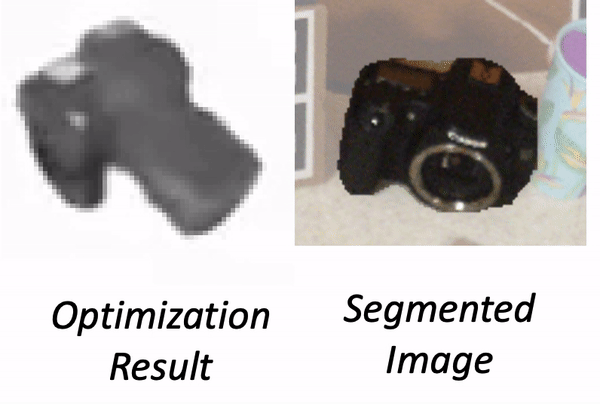

# Category Level Object Pose Estimation via Neural Analysis-by-Synthesis
[Paper](https://arxiv.org/pdf/2008.08145.pdf)|[Project Page](https://ait.ethz.ch/projects/2020/neural-object-fitting/)



This repository contains the code for the paper [Category Level Object Pose Estimation via Neural Analysis-by-Synthesis](https://arxiv.org/pdf/2008.08145.pdf).

# Installation
This code has been tested in Ubuntu 18.04 and Python 3.7.7. 
```
conda create -n neural_object_fitting python=3.7
conda activate neural_object_fitting
conda install pytorch=1.1.0 torchvision=0.3.0 cudatoolkit=10.0 -c pytorch
pip install -r requirements.txt
```

# Preparation
Run the following command to download the datasets and checkpoints. This script downloads the real test dataset from [NOCS](https://github.com/hughw19/NOCS_CVPR2019#datasets), our synthetic training set, and our pre-trained models. Our method uses 2D detections and segmentations predicted by NOCS. This script also downloads the pre-computed results. You can also obtain these predictions by running NOCS following the instructions in the [original repo](https://github.com/hughw19/NOCS_CVPR2019)

```
sh prepare_datasets.sh
```

# Evaluation
## Estimate Pose
Run the following command to estimate poses. 

```
python eval.py --config configs/eval.yaml
```

Note: a full evaluation can take ~2 days on a single 1080Ti GPU. You can split the evaluation into multiple batches which can then be run in parallel on a cluster. For example, the following command splits the job into two parts, and each agent takes care of one.
```
python eval.py --config configs/eval.yaml --num_agent 2 --id_agent 0
python eval.py --config configs/eval.yaml --num_agent 2 --id_agent 1
```

You can also run the evaluation on a subset of the data first for a sanity check. This can be done by specifying `--skip` option, e.g. with `--skip 10` only 1/10 data will be evaluated.
```
python eval.py --config configs/eval.yaml --skip 10
```

To visualize the fitting procedure, add `--vis` to the command.
```
python eval.py --config configs/eval.yaml --vis
```

## Compute Score
Run the following command to evaluate the estimated poses and draw the plot.
```
python nocs/eval.py
```

This should produce similar results to [this one](https://dataset.ait.ethz.ch/downloads/IJNQ4hZGrB/results.pkl). Note that there might be a small variance due to the randomness of initialization.

# Training
Run the following command to train the model for laptop category. Modify `--category` to train models for other categories. Each of the provided checkpoints was trained for 24h on a single 1080Ti GPU.

```
python train.py --config configs/config.yaml --category laptop
```

Note: we use [Weight&Bias](https://wandb.ai/site) for experiment logging which requires registration (for free). To avoid registration, you can deactivate the usage of Weight&Bias by removing `wandb` from `visualizers` in `configs/config.yaml`.


# Citation
If you find this repository useful, please consider citing our paper.
```
@article{chen2020category,
  title={Category Level Object Pose Estimation via Neural Analysis-by-Synthesis},
  author={Chen, Xu and Dong, Zijian, and Song, Jie and Geiger, Andreas and Hilliges, Otmar},
  year= {2020},
  booktitle = {European Conference on Computer Vision (ECCV)},
}
```

# Acknowledgement
This code is based on [pytorch-CycleGAN-and-pix2pix](https://github.com/junyanz/pytorch-CycleGAN-and-pix2pix.git).